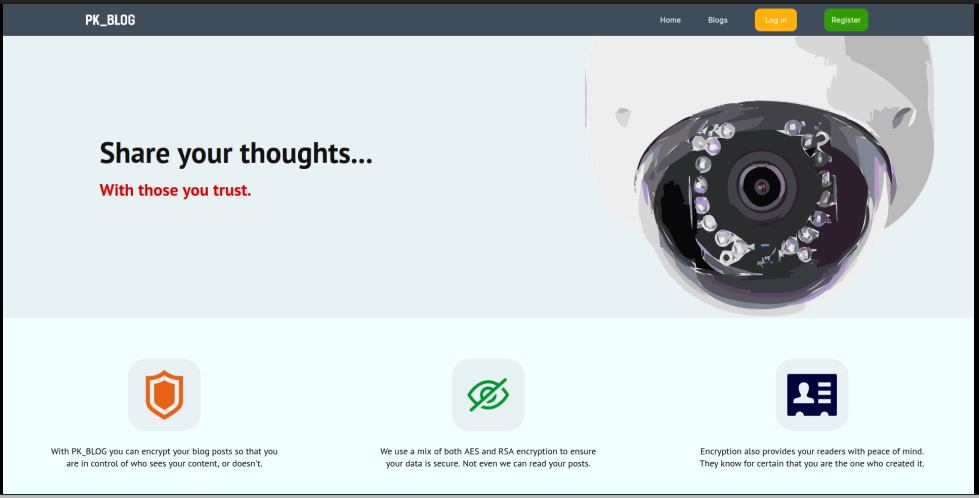

# pk_blog
A CRUD blog application that uses private and public key encryption for security and nonrepudiation.

This project was inspired by some of the knowledge I aquired when studying for the CompTIA Network + exam. I found the topic of encryption (particularly assymetric encryption) fascinating and was eager to try implementing this with Django and Python in a web application.

The app allows for users to write blog posts, encrypt the text with AES, then assymmetrically encrypt the AES key with RSA.
The blog, and the RSA encrypted key is saved to the database. The user who created the blog will be given the Private RSA key (for decryption). They can then share the link to their post, and the private key with those they want to be able to read the post.

The project is still in developent, although by looking at the enkrypt.py module, you will be able to see the complete, functioning encryption/decryption logic. I used a class based approach here, to allow for future use of the module in other projects.

Currently working:

- Encryption and Decryption module
- User account creation
- Blog creation and encryption
- Log in / log out functionality
- PostgresQL database
- Responsive Navbar
- Url creation for new blog posts
- Presenting user with private key after creating blog
- Users can now decrypt blogs they wish to read
- Page for browsing unencrypted, public posts 

To do list:
- Check if user is logged in to allow for blog creation.
- Complete user dashboard.
- Add social elements, friend assocations between accounts.
- Refresh styling of blog browsing page - currently very anemic. 

In future I would also like to replace the function based views with class based views.
